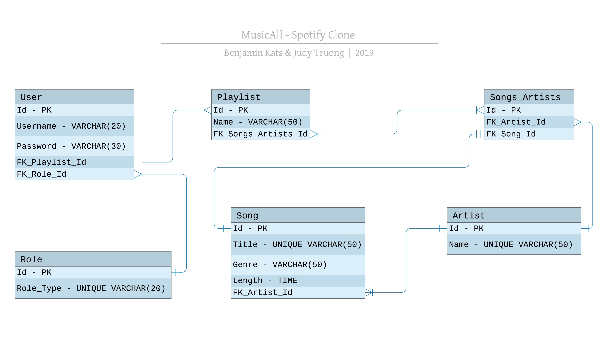

# MusicAll
A Spring Boot & Postgres Spotify Clone

## MusicAll Colleagues 
- Benjamin Kats (@<a href = "https://github.com/BenKats">BenKats</a>)
- Judy Truong (@<a href="https://https://github.com/judycodes">JudyCodes</a>)

## Technologies
- Spring Boot
- Postgres
  
## Application Approach

_Day 1_ | _Day 2_ | _Day 3_ | _Day 4_ | _Day 5_ | _Day 6_ |
--- | --- | --- | --- | --- | --- |
Spring Boot Setup | ERD Brainstorm & Designed | Create Role Endpoint | Playlist, Artist & Song - Model, Repository | JWT Functional - Signup & Login | Signup & Login Testing
Profile Configuration | Git Workflow Implementation | User, Signup, & Login Endpoints | Spring Security & JWT Started | Relational Mapping | 
    |     | User & Role - Model, Repository, Controller, & Service | | | Delete User Functionality |
    |     
    |     |     |     |  | ERD Design Update |     
        
### MusicAll Entity Relationship Diagram
 

### Models Information
- musicAll has five data models: `User`,`Role`, `Song`, `Artist`, `Songs_Artists` & `Playlist`.
- `User` Model has the fields: id, username, password, playlist_id, & role_id.
- `Role` Model has the fields: id & role_type.
- `Playlist` Model has the fields: id, name, & songs_artist_id. 
- `Song` Model has the fields: id, title, genre, length & artist_id.
- `Artist` Model has the fields: id & name.
- `Songs_Artists` is a JOIN table connecting each song to an artist.

- Users MUST have at least one playlist and should have the default role of 'user'. This is to encourage users to fulfill the purpose of the application, which is to gather songs into a playlist. The default role of 'user' for accounts created is to specify and limit the privileges of users. 
- Each playlist MUST contain at least one song, which is to further encourage users to build their playlist of songs. 
- Each song has an artist & an artist can have one or many songs.   
 
## Completions
- Signup and Login endpoints are fully functional 
- JWT & Spring Security enabled on application

## Challenges
- Understanding the idiosyncrasies of Spring Boot

## Reflection 
### Which part you enjoyed working on the most?
- **Judy:** Pair programming and collaboratively brainstorming was educational and energizing, particularly when overcoming challenges, researching concepts, and resolving bugs. 

- **Benjamin:**

